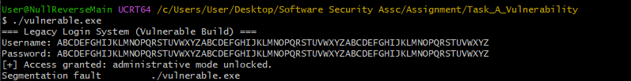
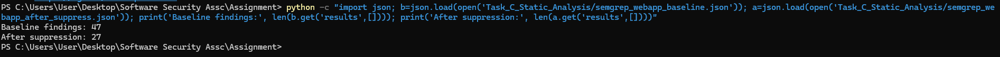

# 7021SCN Software Security Assignment Repository

This repo contains my full work for the assignment, including each task write-up, screenshots, and supporting files.

## Root Artifacts

- `README.md` - overview of the full assignment work (this file).
- `7021SCN_Report_Arkar_Hmue_Htet` - The Report.

## Task Directory Map

- `Task_A_Vulnerability/`
  - `vulnerable.c` - intentionally vulnerable C login simulation using `gets()`.
  - `secure.c` - remediated implementation using bounded input handling.
  - `Task_A_README.md` - exploit workflow, technical root cause analysis, and fix rationale.
- `Task_B_Threat_Model/`
  - `Task_B_README.md` - STRIDE threat model for a Telehealth web application with SDLC-integrated mitigations.
- `Task_C_Static_Analysis/`
  - `Task_C_README.md` - static analysis results, false-positive triage approach, and limitations.
- `Task_D_Dynamic_Analysis/`
  - `Task_D_README.md` - practical OWASP ZAP test procedure for SQLi/XSS, evidence checklist, and critical tooling limitations.
- `Task_E_Compliance/`
  - `Task_E_README.md` - SBOM-to-NIST SSDF mapping and supply-chain assurance analysis.
  - `sbom.spdx.json` - real local Syft-generated SPDX SBOM.
  - `sbom.cyclonedx.json` - CycloneDX SBOM output aligned to CI artifact expectations.
- `.github/workflows/`
  - `semgrep.yml` - CI pipeline for automated Semgrep scans.
  - `generate-sbom.yml` - CI pipeline for automated CycloneDX SBOM generation.

## Notes

In each task folder, I included:

- The task README explaining what was done and why.
- An `evidence/` folder with screenshots/figures referenced in that README.
- Any supporting technical artifacts required for reproducibility.

## Task Summary with Key Evidence

### Task A - Vulnerability Discovery and Remediation

I demonstrated buffer overflow behavior in an unsafe C program and then validated remediation using bounded input handling.

### Task B - STRIDE Threat Modeling

I produced a STRIDE model supported by DFD Level 0/1/2 decomposition and traceable mitigation mapping.

### Task C - Static Analysis and Triage

I ran Semgrep on the web application, performed triage, applied targeted suppression, and compared before/after results.

### Task D - Dynamic Analysis (ZAP)

I validated SQL injection and stored XSS behavior with runtime evidence and scanner correlation.

### Task E - SBOM and Compliance Mapping

I generated SBOM artifacts, aligned them with CI workflow evidence, and mapped implementation to NIST SSDF practices.

## Quick Links to Full Task Write-ups

- [Task A - Vulnerability Discovery and Remediation](Task_A_Vulnerability/Task_A_README.md)
- [Task B - STRIDE Threat Model](Task_B_Threat_Model/Task_B_README.md)
- [Task C - Static Analysis](Task_C_Static_Analysis/Task_C_README.md)
- [Task D - Dynamic Analysis (OWASP ZAP)](Task_D_Dynamic_Analysis/Task_D_README.md)
- [Task E - Compliance and SBOM](Task_E_Compliance/Task_E_README.md)
