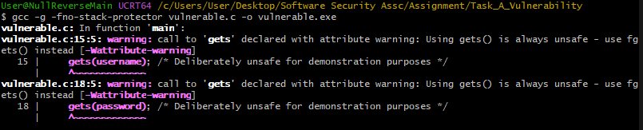
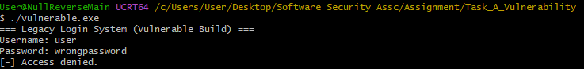
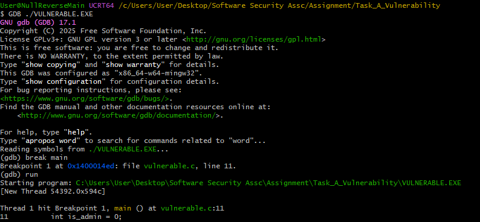
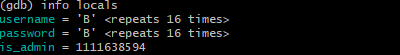
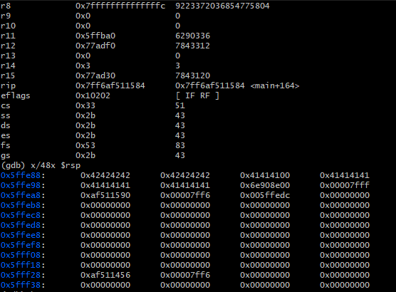
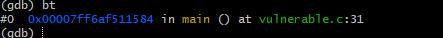
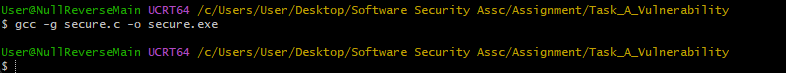
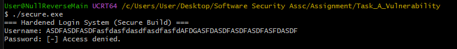
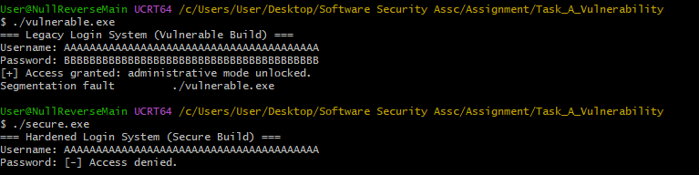

# Task A - Vulnerability Discovery and Remediation

## Objective

Demonstrate discovery, exploitability, and remediation of a memory-safety flaw in a C authentication program.

## What I Did In This Task

In this task, I intentionally implemented an unsafe authentication flow in `vulnerable.c` using `gets()` to create a reproducible memory-safety failure case. I then compiled and exercised the program with oversized payloads to observe corruption effects under adversarial input conditions, and used GDB to validate the failure mechanics at runtime (locals, stack state, and crash path). I subsequently refactored the same logic in `secure.c` with bounded input handling (`fgets()`), repeated equivalent stress inputs, and documented the behavioral delta as evidence of remediation effectiveness rather than relying on theoretical claims alone.

## Vulnerability Overview

The vulnerable implementation (`vulnerable.c`) uses `gets()` to read into fixed-size stack buffers (`username[16]`, `password[16]`). `gets()` performs no bounds checking, so attacker-controlled input can overwrite adjacent stack memory, including security-relevant variables and potentially saved control-flow state.

### Why This Is Critical

- **CWE-242 (Use of Inherently Dangerous Function)** and **CWE-120 (Classic Buffer Overflow)**.
- Can corrupt authentication state (`is_admin`) and bypass security checks.
- In less protected builds, overflow can also hijack return addresses and redirect execution.

## Remediation Strategy

The secure version (`secure.c`) uses:

- `fgets()` with explicit buffer length.
- Newline stripping helper to normalize input.
- Input failure checks.
- Same functional logic but with bounded, safe input handling.

## Why the Fix Works

`fgets(dst, sizeof(dst), stdin)` enforces maximum bytes written into destination, preventing writes beyond stack object boundaries. This blocks the overwrite primitive required for both state corruption and instruction-pointer manipulation.

## Actual Execution Evidence (This Submission)

### Compiler Commands Used

```bash
gcc -g -fno-stack-protector vulnerable.c -o vulnerable.exe
gcc -g secure.c -o secure.exe
```

### Payload Length Used

- Username payload: 64-80 characters (`A...A`).
- Password payload: 64-80 characters (`B...B`).

### Vulnerable Observed Effect

When oversized payloads were provided to `gets()`, the vulnerable build demonstrated clear memory corruption:

- The program incorrectly printed `Access granted: administrative mode unlocked` without valid credentials, indicating corruption of authentication state (`is_admin`).
- Execution then terminated with `SIGSEGV`, consistent with stack corruption affecting control-flow integrity.

### Debugger Evidence Summary

GDB inspection after overflow input provided runtime proof of corruption:

- Breakpoint and single-step tracing confirmed execution reached unsafe `gets()` calls.
- `info locals` captured post-input local-variable state.
- `info registers` and stack memory dump (`x/48x $rsp`) provided low-level evidence of overwritten runtime state.
- Backtrace at crash confirmed segmentation fault occurred after corrupted execution path.

### Secure Retest Outcome

Running the same long payloads against `secure.exe` (using `fgets()` and bounded input handling) produced stable behavior:

- No segmentation fault.
- No unauthorized privilege escalation.
- Input was handled safely while preserving expected authentication logic.

## Walkthrough with Evidence (All Files)

### A1 - Vulnerable compile warning

This confirms successful compilation and explicit compiler warning that `gets()` is unsafe.



### A2 - Baseline denial behavior

This baseline run confirms normal failed-login behavior before overflow payload testing.



### A3 - Overflow runtime effect

This run shows the vulnerable behavior under oversized input and supports exploitability claims.


### A4 - GDB breakpoint setup

This screenshot documents debugger control point setup for reproducible runtime analysis.



### A5 - Local variable state after payload

This evidence captures local variable state after malicious-length input is processed.



### A6 - Stack/register corruption evidence

This provides low-level memory/register context supporting overflow impact assessment.



### A6b - Crash backtrace evidence

This backtrace supports the claim that corrupted execution path leads to segmentation fault.



### A7 - Secure compile proof

This confirms successful compilation of the remediated implementation.



### A8 - Secure long-input stability

This validates that the secure version remains stable under the same stress input class.



### A9 - Vulnerable vs secure comparison

This side-by-side comparison summarizes the security and runtime behavior difference after remediation.



