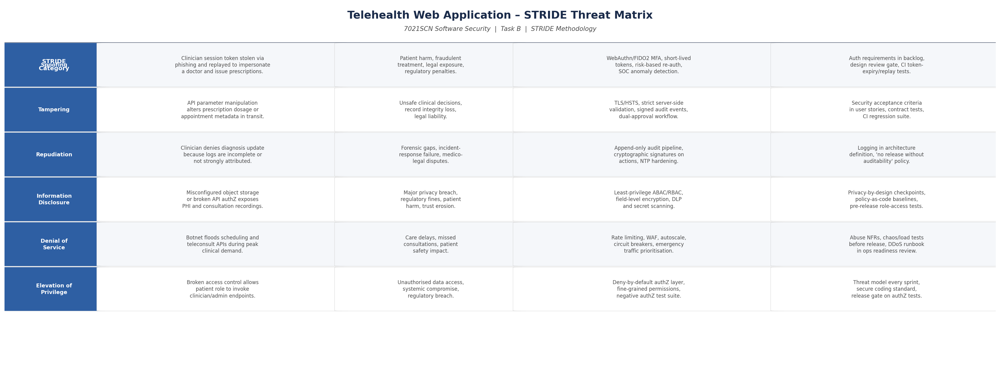
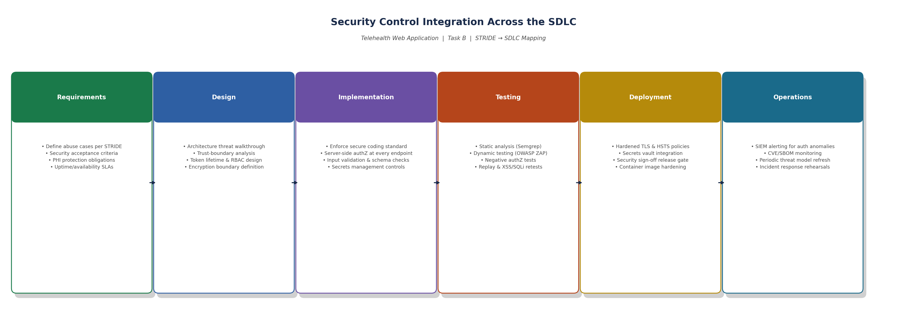
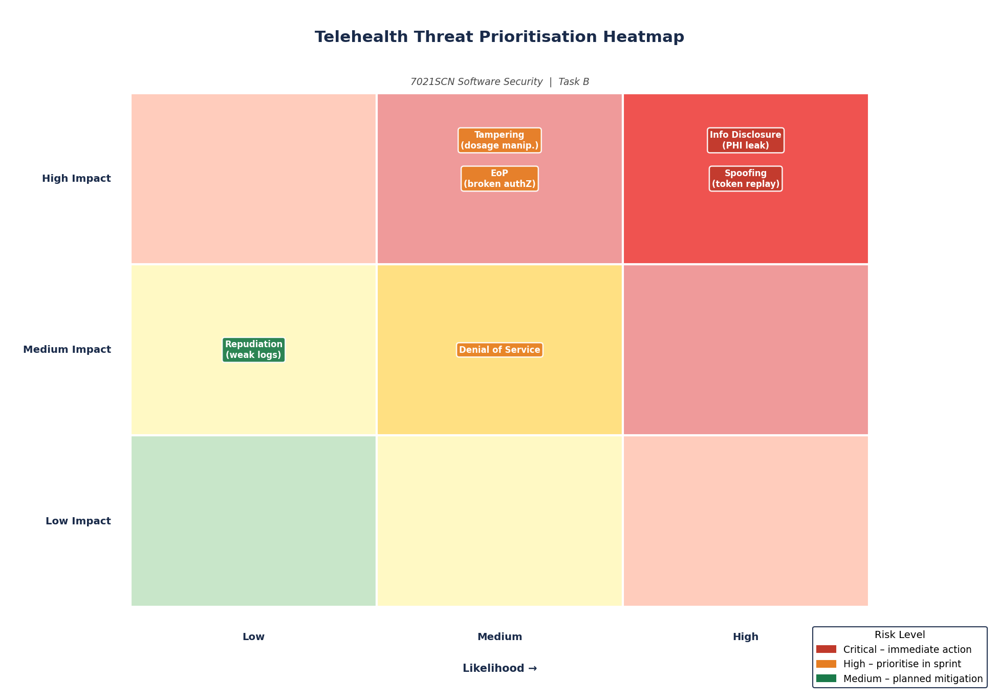
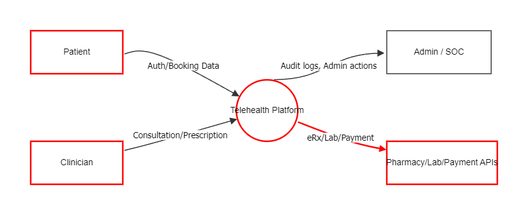
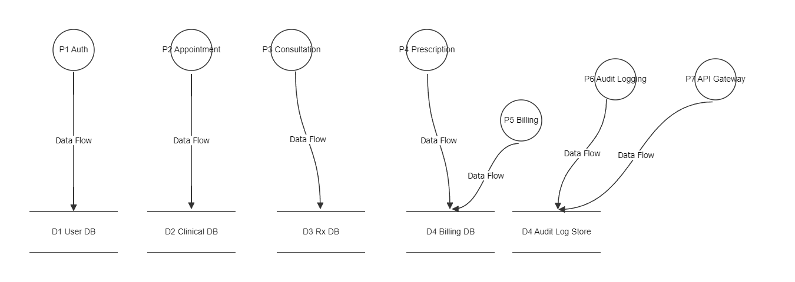
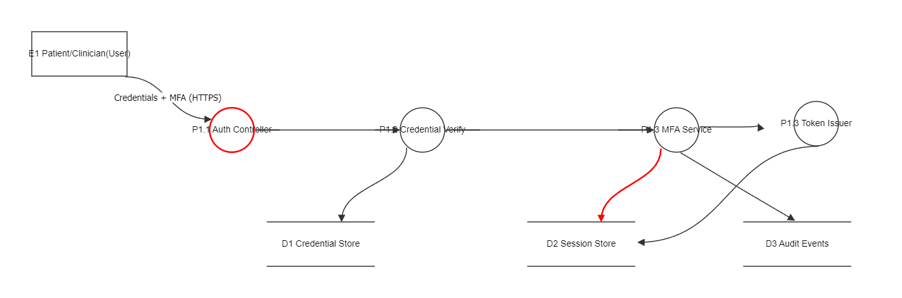

# Task B - STRIDE Threat Model for Telehealth Web Application

## System Context

The hypothetical platform supports patient registration, video consultation, e-prescriptions, clinician dashboards, billing, and integration with pharmacy/lab APIs. Sensitive assets include PHI, clinical notes, prescriptions, payment metadata, session tokens, and audit logs.

## What I Did In This Task

For this task, I approached the telehealth platform as a high-impact socio-technical system and performed a structured STRIDE assessment across confidentiality, integrity, availability, and accountability concerns. For each category, I articulated a concrete attack narrative, assessed operational and clinical impact, and mapped mitigations to enforceable SDLC control points (design, implementation, testing, and release governance). I also developed Level 0, Level 1, and Level 2 DFDs to ground the analysis in explicit trust boundaries and data flow semantics, then exported the complete model in Threat Dragon (`Telehealth_ThreatDragon_Finished.json`) to preserve transparency and reproducibility.

## STRIDE Analysis

## 1) Spoofing

**Threat:** Adversary steals clinician OAuth/session tokens via phishing + token replay to impersonate a doctor and issue fraudulent prescriptions.

**Impact:** Unauthorized medication issuance, patient harm, legal exposure, trust breakdown, and severe regulatory penalties.

**Tailored Mitigations:**

- Phishing-resistant MFA (FIDO2/WebAuthn) for clinician accounts.
- Short-lived tokens with sender-constrained token binding (DPoP/mTLS where feasible).
- Risk-adaptive authentication (new device, unusual geo/time, impossible travel).
- Credential/session anomaly detection integrated with SOC alerting.

**SDLC Integration:**

- Define identity assurance requirements during backlog grooming.
- Add threat abuse stories to sprint planning.
- Enforce auth design review gates before implementation.
- Add automated tests for token expiry, replay rejection, and step-up auth.

## 2) Tampering

**Threat:** API request manipulation changes prescription dosage or appointment metadata in transit or through insecure server-side validation.

**Impact:** Clinical safety risk, inaccurate records, and treatment errors.

**Tailored Mitigations:**

- End-to-end integrity controls (TLS everywhere, HSTS, secure reverse proxy policy).
- Server-side schema validation and strict allow-list business rules.
- Immutable, signed audit events for critical record changes.
- Dual-approval workflow for high-risk prescription updates.

**SDLC Integration:**

- Security acceptance criteria in user stories for every mutable clinical field.
- Contract tests to reject malformed/semantically invalid updates.
- Security regression suites in CI for critical workflows.

## 3) Repudiation

**Threat:** Provider denies altering a diagnosis because logs are incomplete, mutable, or not attributable to a strong identity.

**Impact:** Forensic gaps, failed incident response, medico-legal disputes.

**Tailored Mitigations:**

- Append-only, centralized audit pipeline with cryptographic integrity checks.
- Signed clinician actions with high-assurance identity context.
- Time-synchronized systems (NTP hardening) for trustworthy event chronology.

**SDLC Integration:**

- Logging requirements captured in architecture definition.
- "No feature without auditability" policy as a release criterion.
- Periodic tabletop exercises validating non-repudiation evidence quality.

## 4) Information Disclosure

**Threat:** Misconfigured object storage/API authorization leak exposes consultation recordings and PHI.

**Impact:** Major privacy breach, patient harm, regulatory fines, reputational damage.

**Tailored Mitigations:**

- Data classification + least-privilege access model.
- Field-level encryption/tokenization for sensitive attributes.
- ABAC/RBAC enforcement at API gateway and service layer.
- Automated secret scanning and DLP controls for exports/logs.

**SDLC Integration:**

- Privacy-by-design threat checkpoints during architecture and design.
- Mandatory secure config baselines as code.
- Pre-release access-control verification tests across all roles.

## 5) Denial of Service

**Threat:** Botnet floods appointment and teleconsult APIs, degrading service during peak clinical demand.

**Impact:** Care delays, missed consultations, possible patient safety incidents.

**Tailored Mitigations:**

- Multi-layer rate limiting, WAF bot mitigation, and autoscaling protections.
- Priority traffic channels for emergency/critical-care workflows.
- Circuit breakers and graceful degradation mechanisms.
- DDoS runbooks with rehearsed escalation paths.

**SDLC Integration:**

- Performance-abuse scenarios in non-functional requirements.
- Chaos/load testing pipelines before production release.
- Operational readiness reviews include anti-DoS posture checks.

## 6) Elevation of Privilege

**Threat:** Broken access control in admin endpoints allows a patient account to invoke clinician/admin actions.

**Impact:** Unauthorized data access/modification, systemic platform compromise.

**Tailored Mitigations:**

- Centralized authorization middleware with deny-by-default policy.
- Fine-grained permission model and service-to-service auth hardening.
- Continuous authorization testing (negative tests for role boundary violations).
- Privileged endpoint inventory with explicit owner accountability.

**SDLC Integration:**

- Threat modeling as a recurring sprint ceremony, not a one-time artifact.
- Secure coding standards mandate server-side authorization checks.
- Release gate requires passing access-control test suite.

## Critical Evaluation

The most significant risk drivers are identity compromise, broken authorization, and PHI exposure. Generic mitigations are insufficient; healthcare requires resilience measures tied to patient safety, legal non-repudiation, and continuity of care. Embedding controls directly into backlog definitions, coding standards, test automation, and release governance shifts security from reactive patching to proactive risk reduction.

## Data Flow Diagrams (DFD Decomposition)

To strengthen attack-surface analysis, the STRIDE model is supported by three DFD abstraction levels:

- **Level 0 (Context):** identifies external entities, high-level trust boundaries, and system ingress/egress channels.
- **Level 1 (Process decomposition):** breaks the platform into major security-relevant processes and data stores.
- **Level 2 (Auth deep dive):** decomposes authentication/session internals to expose spoofing, replay, and privilege escalation risk paths.

These diagrams provide structural justification for the threat scenarios and mitigation priorities selected in STRIDE.

## Threat Dragon Usage (Method and Traceability)

The DFD hierarchy was modeled in OWASP Threat Dragon and then exported as evidence images. Threat identification was performed with STRIDE categories mapped against:

- actor/process identity boundaries (Spoofing, Elevation of Privilege),
- mutable clinical data flows and stores (Tampering, Information Disclosure),
- logging and evidential control paths (Repudiation),
- availability-critical service dependencies (Denial of Service).

This helped me keep the mitigations practical and directly linked to real attack paths in the model.

## Walkthrough with Evidence (All Files)

### B1 - STRIDE matrix overview

This matrix consolidates threat scenario, impact, mitigation, and SDLC integration per STRIDE category.

### B2 - SDLC integration mapping

This visual maps security controls to lifecycle stages to show where mitigations are enforced.

### B3 - Threat prioritization heatmap

This heatmap shows relative risk prioritization used to justify treatment order.

### B4 - DFD Level 0 context

This diagram captures system boundary, external entities, and primary trust boundaries.

### B5 - DFD Level 1 process decomposition

This level breaks the platform into core processes and data stores for threat traceability.

### B6 - DFD Level 2 auth/session flow

This deep-dive view supports spoofing/replay/privilege analysis in authentication pathways.

