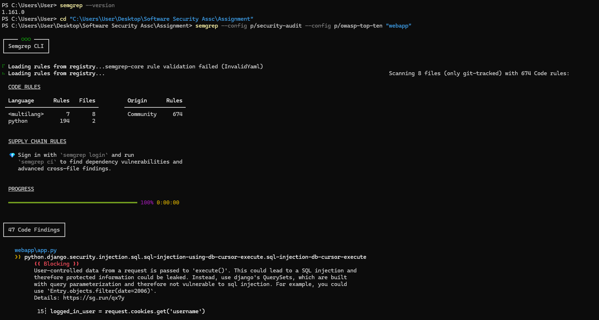
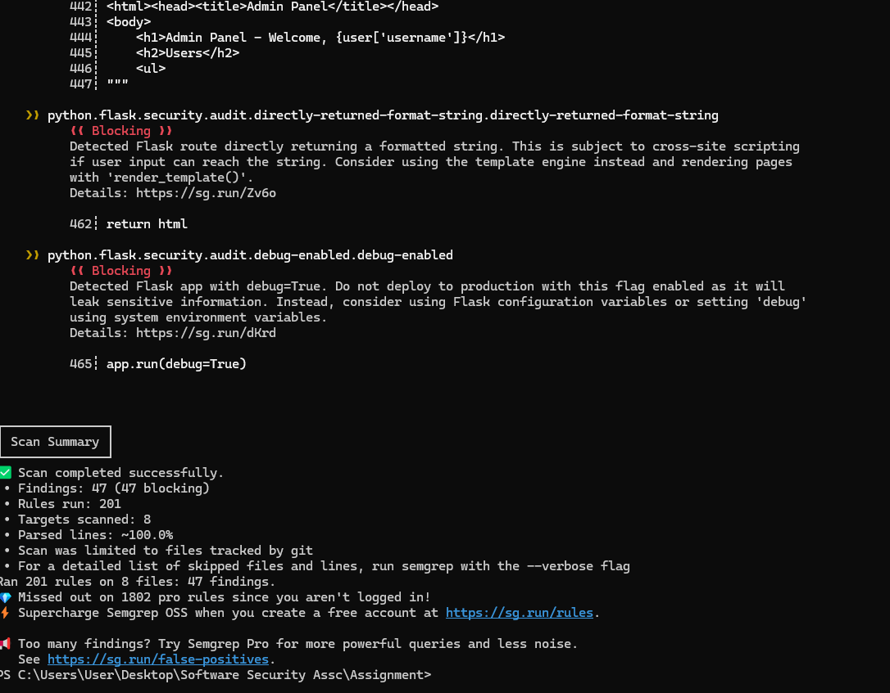
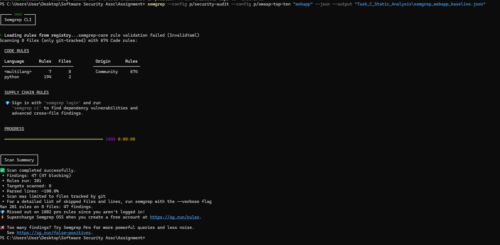
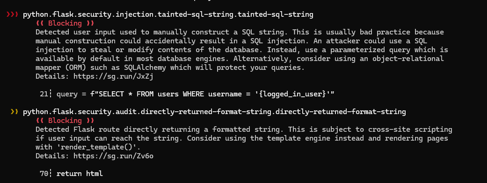
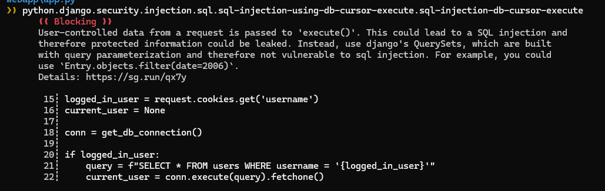
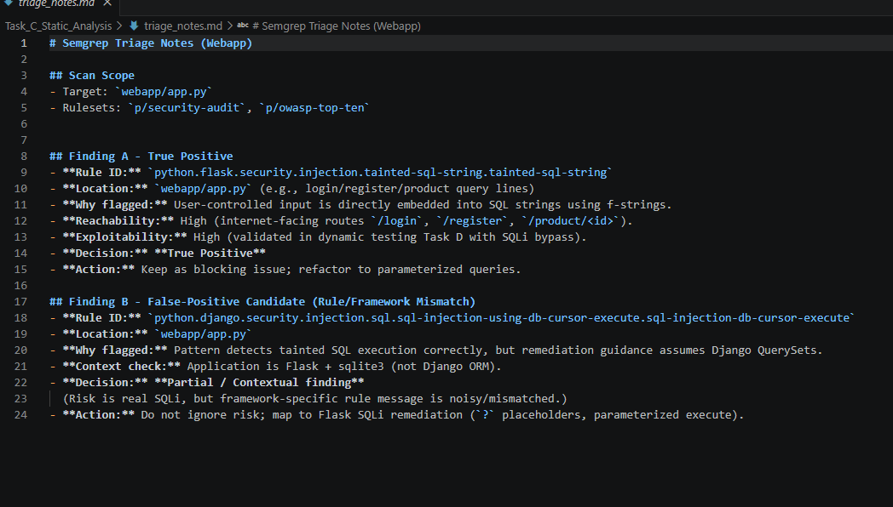
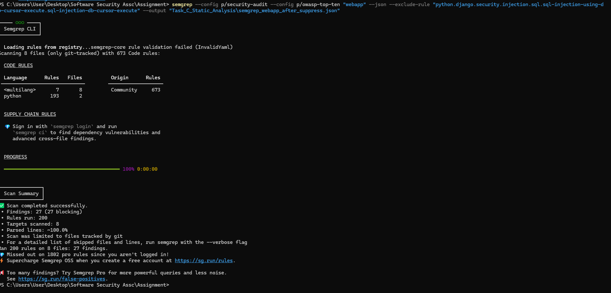
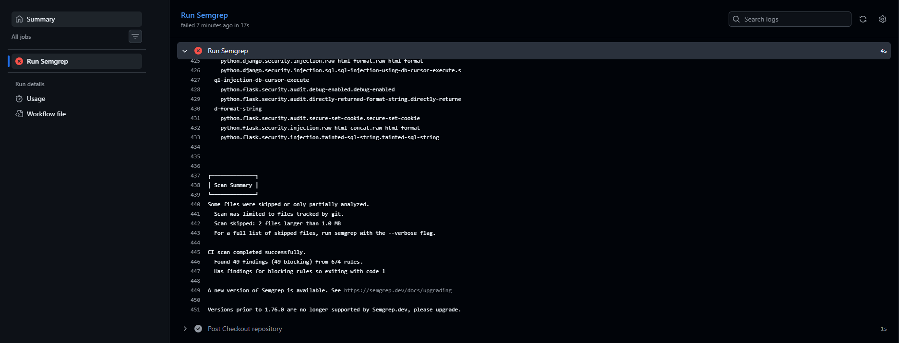
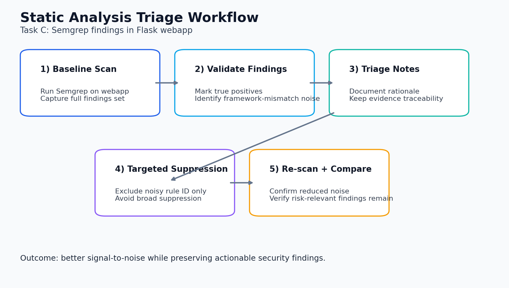
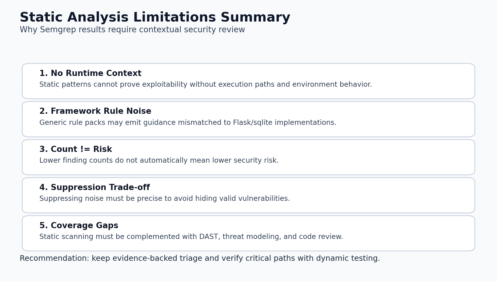

# Task C - Automated Security Testing (Webapp-Focused Semgrep Analysis)

## Scope and Objective

In this task, I used Semgrep on the local Flask app (`webapp/`), then triaged the findings, applied targeted suppression for noisy rules, and validated the result with a re-scan.

## What I Did In This Task

In this task, I used Semgrep against the production-relevant `webapp/` scope and established a baseline finding set before introducing any triage actions. I then conducted analyst-led review to distinguish high-confidence security defects from framework-context noise, explicitly documenting decision logic in `triage_notes.md`. Rather than broad suppression, I applied narrowly scoped rule exclusion and performed a controlled re-scan to evaluate signal-to-noise improvement while preserving materially relevant SQLi risk indicators. I also captured CI/CD execution evidence and included a limitations analysis to demonstrate methodological understanding beyond tool-centric metrics.

## CI/CD Configuration

Semgrep CI/CD integration is configured in:

- `.github/workflows/semgrep.yml`

The workflow runs on push, pull request, and manual dispatch. I included screenshots of the workflow run and job details.

## Baseline Webapp Scan

### Command

```powershell
semgrep --config p/security-audit --config p/owasp-top-ten "webapp" --json --output "Task_C_Static_Analysis\semgrep_webapp_baseline.json"
```

### Baseline Result

- Findings: **47** (47 blocking)
- Rules run: 201
- Targets scanned: 8 files

This baseline confirms broad static risk exposure in `webapp/app.py`, especially SQL injection and unsafe HTML construction patterns.

## True Positive Example

### Rule ID

- `python.flask.security.injection.tainted-sql-string.tainted-sql-string`

### Evidence

Semgrep flagged f-string SQL query construction with user-controlled input:

- Example line: `query = f"SELECT * FROM users WHERE username = '{logged_in_user}'"`

### Triage Decision

- **True Positive** (high confidence)
- Reachable in internet-facing routes
- Exploitability validated by dynamic SQLi evidence in Task D

## False-Positive Candidate and Triage

### Candidate Rule

- `python.django.security.injection.sql.sql-injection-using-db-cursor-execute.sql-injection-db-cursor-execute`

### Why Candidate (Not Blindly Suppressed)

- The rule’s remediation guidance is Django-specific (QuerySet-based), while the target is Flask + sqlite3.
- However, the underlying pattern still represents real tainted SQL risk in this application.

### Triage Decision

- **Partial / contextual finding**
- Treat as noisy framework-mismatch signal, but do not ignore the SQLi risk itself.

Detailed rationale is documented in:

- `triage_notes.md`

## Suppression and Re-Scan

To reduce framework-mismatch noise while preserving Flask-relevant security findings, the Django-specific SQL rule was excluded during re-scan.

### Command

```powershell
semgrep --config p/security-audit --config p/owasp-top-ten "webapp" --json --exclude-rule "python.django.security.injection.sql.sql-injection-using-db-cursor-execute.sql-injection-db-cursor-execute" --output "Task_C_Static_Analysis\semgrep_webapp_after_suppress.json"
```

### Result Comparison

- Baseline findings: **47**
- After suppression: **27**

This reduction is expected and justified: suppression removed a noisy framework-mismatched rule family, while high-confidence Flask SQLi findings remained.

## Critical Assessment of Static Analysis Limitations

- Static tools identify risky patterns but cannot fully determine runtime exploitability without context.
- Rule packs can produce framework-noise (e.g., Django-oriented guidance on Flask code).
- Finding count alone is not a quality metric; triage rigor is essential.
- Static analysis cannot replace dynamic testing, threat modeling, or secure code review.
- Best practice is layered assurance: static + dynamic + architecture-level controls.

## Walkthrough with Evidence (All Files)

### C1 - Initial findings view

This captures the baseline Semgrep findings list for the webapp target.



### C1b - Baseline findings summary

This screenshot highlights top-level totals from the initial run (used as comparison baseline).



### C2 - Saved baseline output

This confirms baseline output was persisted for reproducible analysis and comparison.



### C3 - True positive example

This shows a high-confidence SQLi-related finding retained as actionable risk.



### C4 - False-positive candidate

This captures framework-mismatch noise considered during contextual triage.



### C5 - Triage notes evidence

This records analyst rationale behind classification and suppression decisions.



### C6 - Re-scan after suppression

This run confirms targeted suppression outcome without removing core Flask SQLi signals.



### C7 - Before/after comparison

This visual compares baseline and post-triage findings to show signal-to-noise improvement.


### C8 - GitHub Actions workflow run

This proves automated Semgrep execution in CI pipeline context.


### C9 - GitHub Actions job details

This provides detailed evidence of CI job steps and successful completion.



### C10 - Triage workflow diagram

This summarizes the analyst workflow from baseline to validated suppression and re-scan.



### C11 - Tool limitations summary

This visual consolidates key static-analysis limitations and interpretation constraints.



