# Task D - Dynamic Analysis and Exploit Development (OWASP ZAP)

## Scope and Target

Local Flask web application (`http://127.0.0.1:5000`) running an intentionally vulnerable e-commerce shop. Vulnerabilities tested: SQL Injection (SQLi) and Cross-Site Scripting (XSS).

## What I Did In This Task

For dynamic analysis, I executed the vulnerable Flask target locally and used OWASP ZAP to combine passive observation with active assessment. I first established attack-surface coverage through manual exploration and spidering, then validated exploitability through two concrete attack paths: SQL injection authentication bypass and stored XSS in the review pipeline. After reproducing these behaviors, I correlated manual exploit evidence with ZAP alert output by risk and CWE context, and critically evaluated scanner blind spots (workflow depth, business logic, and state-dependent behavior). This allowed me to position DAST as an evidence layer within a broader defense-in-depth validation strategy.

## Target Application Vulnerability Map

The application uses raw Python f-string SQL query construction without parameterisation throughout:

- **Login** (`/login`) — username and password injected directly into SELECT query.
- **Register** (`/register`) — username and password injected directly into INSERT query.
- **Product review** (`/product/<id>`) — comment field injected directly into INSERT query.
- **Review display** — `review['comment']` rendered directly into HTML response with no escaping.

This means the application is simultaneously vulnerable to SQLi (at the query level) and stored XSS (at the rendering level).

## Environment and Tools

- Target: Flask application on `http://127.0.0.1:5000`
- Proxy/Scanner: OWASP ZAP 2.17.0
- Browser: Chromium (controlled by ZAP automated testing)
- OS: Windows 10

## Phase 1 - Application Launch and Proxy Setup

Flask application started and confirmed running at `http://127.0.0.1:5000`. ZAP launched in Manual Explore mode with browser proxy active.

**Evidence:** `evidence/D1_webapp_running.png`, `evidence/D2_zap_launch_manual_explore.png`

## Phase 2 - Discovery (Spider and Sites Tree)

Manual browsing through all application pages populated the ZAP Sites tree with all key endpoints. ZAP Spider then automated endpoint discovery, identifying 15 URLs including GET and POST endpoints for login, register, product pages, and static assets.

**Evidence:** `evidence/D3_zap_sites_tree.png`, `evidence/D4_zap_spider_progress.png`

## Phase 3 - SQL Injection Attack (Login Bypass)

### Payload Used

```
Username: ' OR '1'='1
Password: ' OR '1'='1
```

### Root Cause

The vulnerable login query is:

```python
query = f"SELECT * FROM users WHERE username = '{username}' AND password = '{password}'"
```

Injecting `' OR '1'='1` transforms this to:

```sql
SELECT * FROM users WHERE username = '' OR '1'='1' AND password = '' OR '1'='1'
```

Since `'1'='1'` is always true, the WHERE clause evaluates to true for all rows and returns the first user in the database — the admin account.

### Observed Result

Authenticated as `admin` without supplying valid credentials. Full admin panel access obtained including user list and product management.

**Evidence:** `evidence/D5_sqli_login_payload.png`, `evidence/D6_sqli_bypass_result.png`, `evidence/D7_zap_sqli_request_history.png`

## Phase 4 - Stored Cross-Site Scripting Attack (Product Review)

### Payload Used

```html
<script>alert("XSS by testuser")</script>
```

### Root Cause

The review INSERT query uses raw f-string interpolation:

```python
query = f"INSERT INTO reviews (product_id, author_name, comment) VALUES ({product_id}, '{logged_in_user}', '{comment}')"
```

The review is then rendered directly into the HTML response with no output encoding:

```python
html += f"<p><strong>{review['author_name']}:</strong> {review['comment']}</p>"
```

This means the injected script tag is stored in the database and re-executed in every user's browser on every page load — a stored (persistent) XSS vulnerability.

### Observed Result

JavaScript alert fired immediately on submission and again on every subsequent page reload, confirming persistent server-side storage and client-side execution of attacker-controlled script.

Note: Payloads containing single quotes (e.g. `alert('XSS')`) also triggered an SQL error in the review INSERT query, demonstrating that the same parameter is simultaneously vulnerable to SQLi.

**Evidence:** `evidence/D8_xss_payload_in_review_form.png`, `evidence/D9_xss_alert_popup.png`, `evidence/D10_xss_stored_page_reload.png`, `evidence/D11_zap_xss_request_history.png`

## Phase 5 - Active Scan and Alerts

ZAP Active Scan was run against the full application scope. 19 alerts were generated across risk levels including:

- Absence of Anti-CSRF Tokens (Medium) — CWE-352
- Content Security Policy Header Not Set (Medium)
- Missing Anti-clickjacking Header
- Application Error Disclosure
- Cookie No HttpOnly Flag
- Cookie without SameSite Attribute
- HTTPS Content Available via HTTP
- Information Disclosure (Debug Error Messages, Server Version, Sensitive Info in URL)
- Authentication Request Identified
- Cookie Poisoning
- Session Management Response Identified

**Evidence:** `evidence/D12_zap_active_scan_progress.png`, `evidence/D13_zap_alerts_panel.png`

## Critical Assessment: Limitations of Dynamic Analysis Tools

- **Coverage depends on reachability:** ZAP only tests what it can reach. Authenticated workflows, deep application state, and logic-dependent flows may be missed entirely.
- **Business logic is invisible to scanners:** The admin bypass via SQLi was obvious manually, but automated scanners often miss multi-step authentication logic exploits.
- **False positives require analyst validation:** Several ZAP alerts (e.g. SameSite cookie) were informational findings requiring context to prioritise correctly.
- **Stored XSS requires injection and retrieval:** ZAP detected related header weaknesses but the stored XSS exploit was demonstrated manually — automated crawlers may not follow POST-then-GET review flows.
- **Dynamic analysis is a complement, not a substitute:** Full coverage requires threat modelling, static analysis, manual testing, and dynamic tooling used together.

## Walkthrough with Evidence (All Files)

### D1 - Application running proof

This confirms the vulnerable Flask target is live and ready for controlled testing.

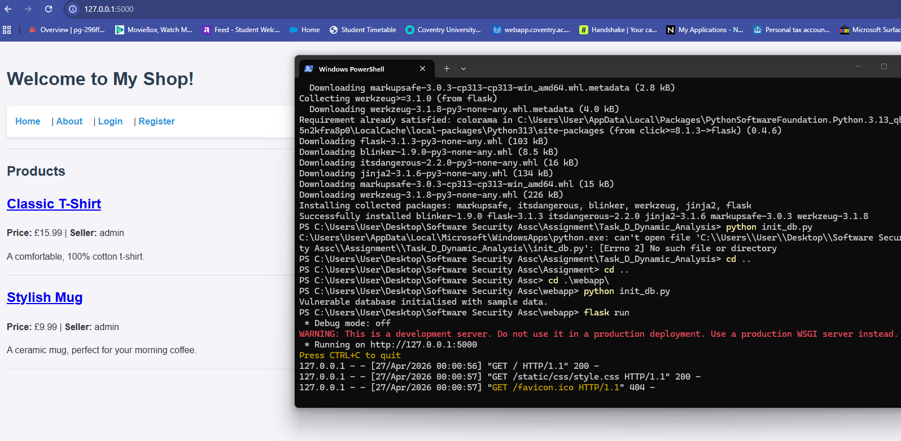

### D2 - ZAP launch/setup

This shows ZAP manual explore setup and test environment readiness.

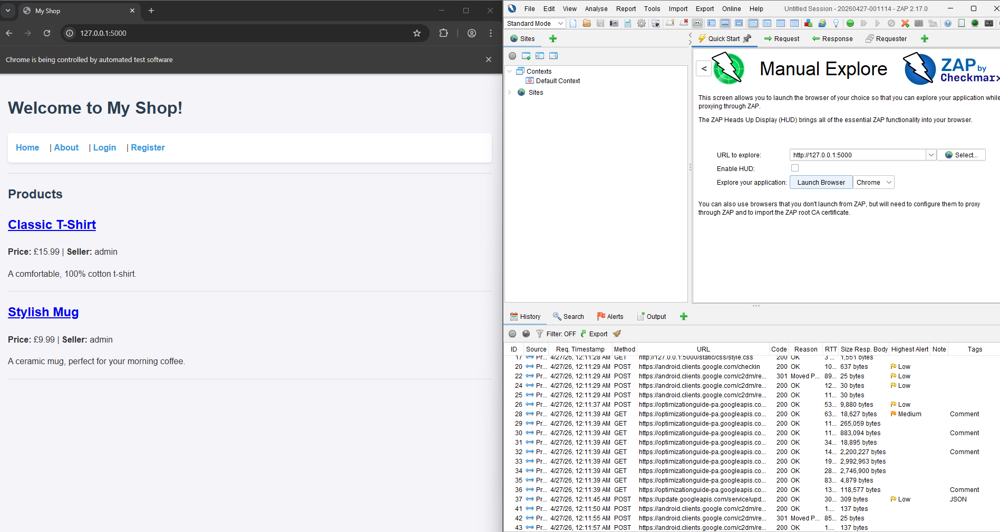

### D3 - Sites tree discovery

This captures endpoint discovery coverage before active exploitation.

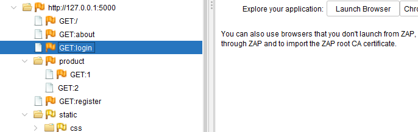

### D4 - Spider progress

This verifies automated crawling and URL discovery depth.

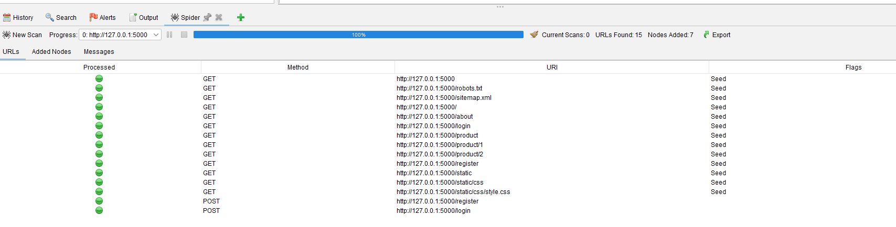

### D5 - SQLi payload input

This records the injection payload used during login-bypass testing.

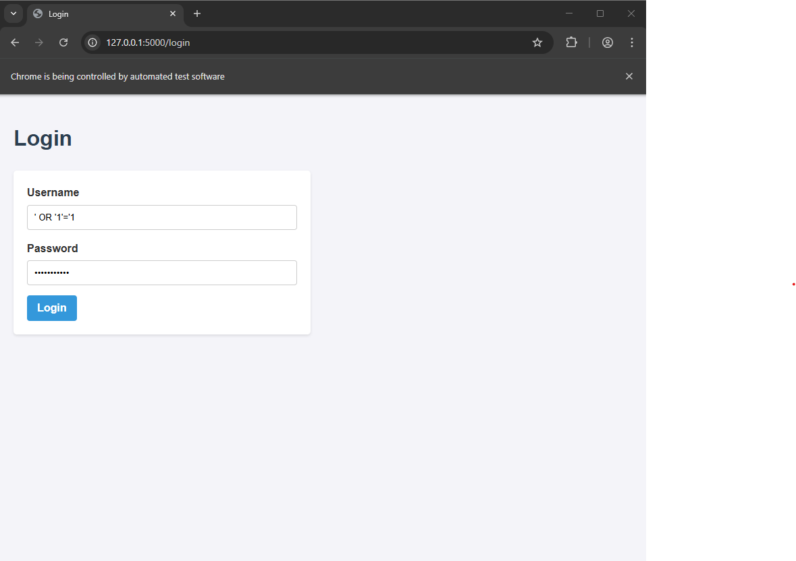

### D6 - SQLi bypass result

This confirms unauthorized administrative access caused by injection.

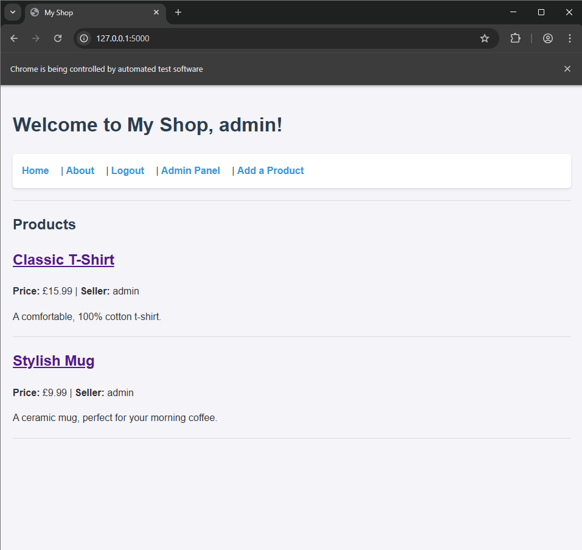

### D7 - SQLi request history

This provides raw proxy-level request evidence for the SQLi attempt.

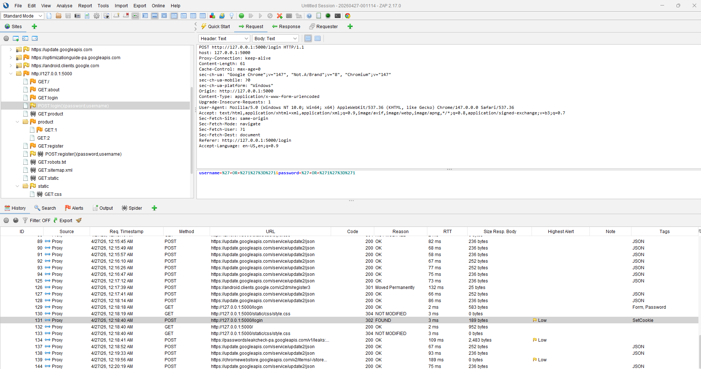

### D8 - XSS payload submission

This captures insertion of malicious script content into review input.

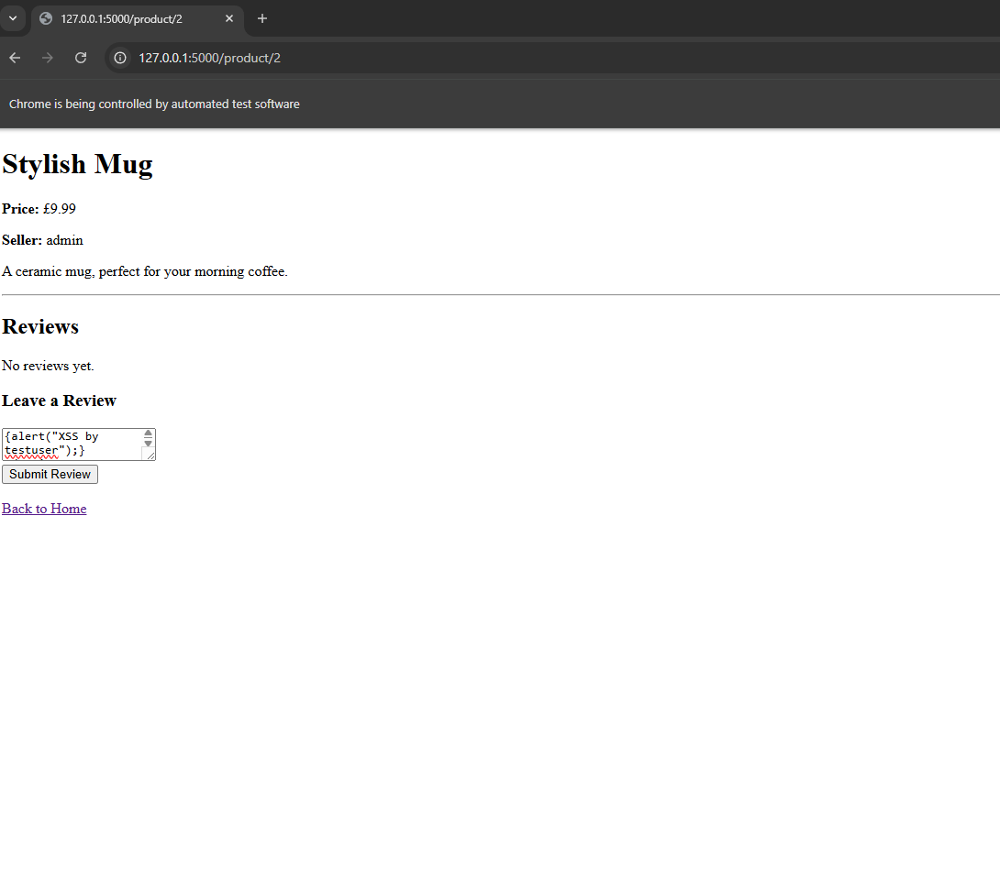

### D9 - XSS execution popup

This confirms JavaScript execution in browser context.

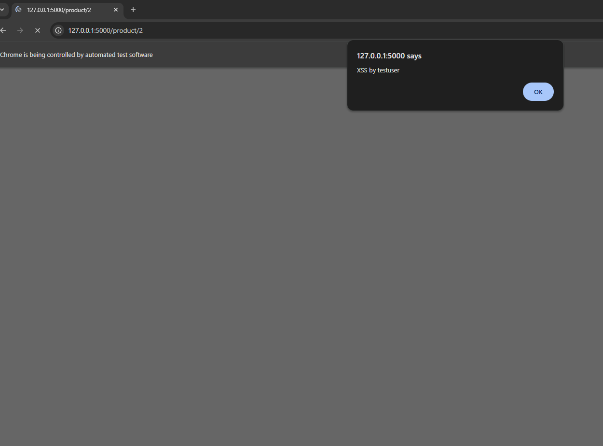

### D10 - Stored XSS persistence

This demonstrates payload execution continues on subsequent page loads.

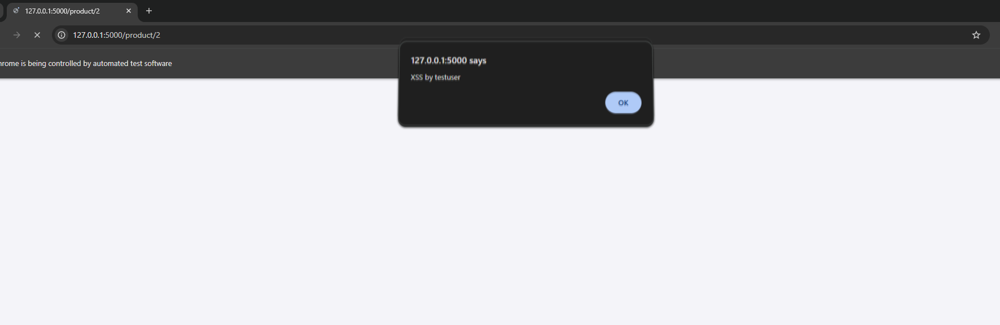

### D11 - XSS request history

This provides raw request evidence linked to stored XSS injection flow.

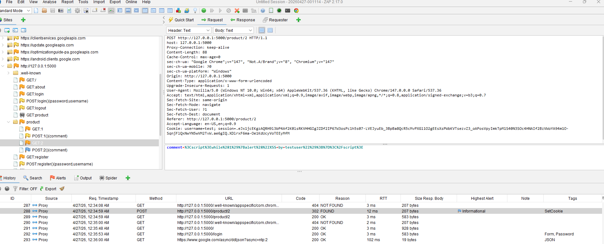

### D12 - Active scan progress

This screenshot shows active scanning execution and coverage phase.

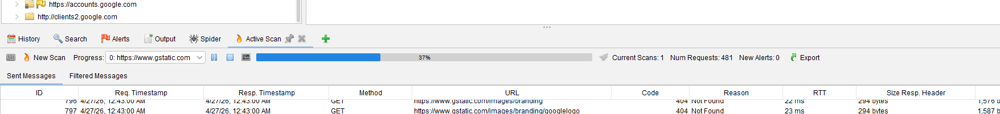

### D13 - Alerts panel summary

This summarizes discovered issues with risk and CWE-linked context.

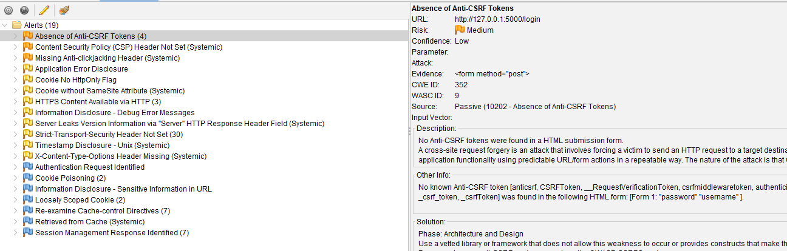

### D14 - Attack flow diagram

This visual explains the practical SQLi and XSS exploit sequence.

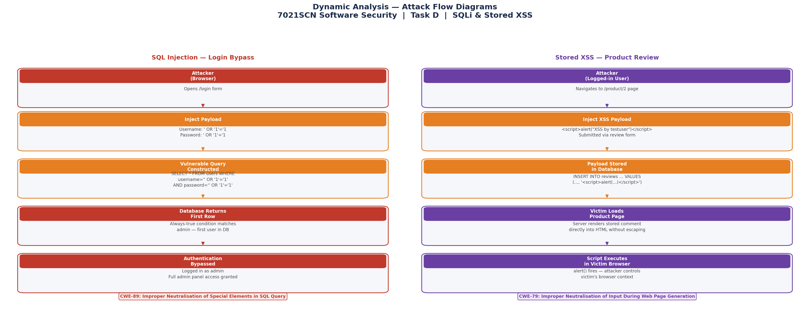

### D15 - Dynamic-analysis limitations

This diagram summarizes DAST blind spots and interpretation constraints.

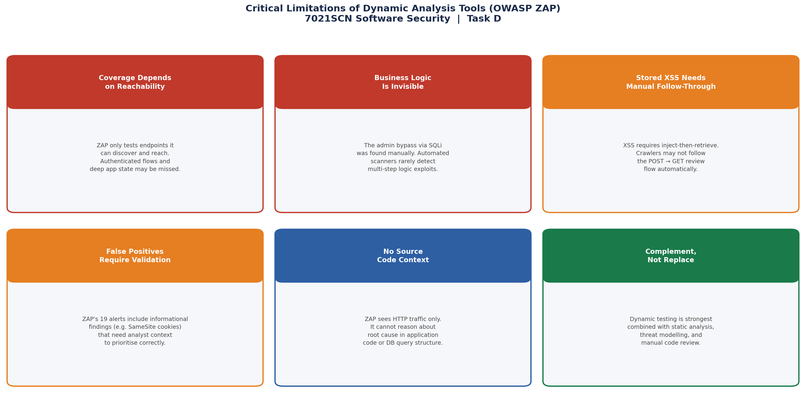

