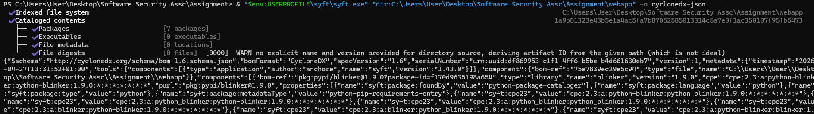
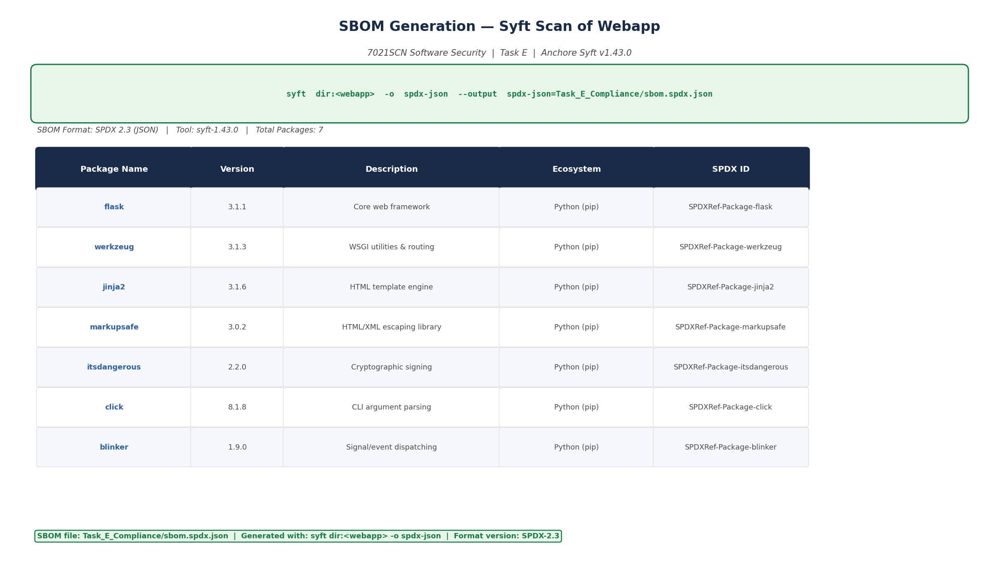
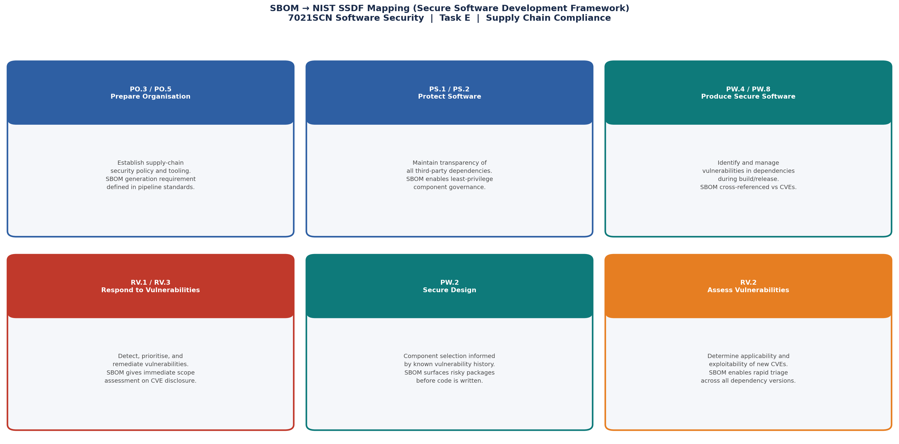
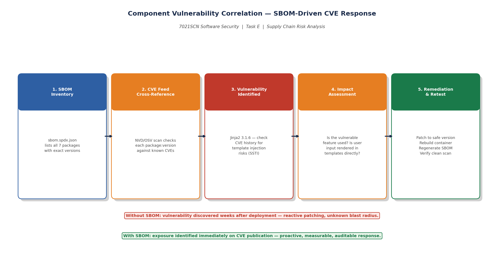
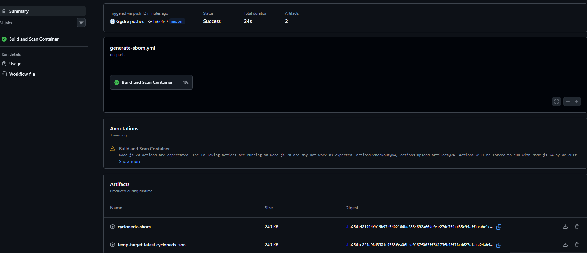
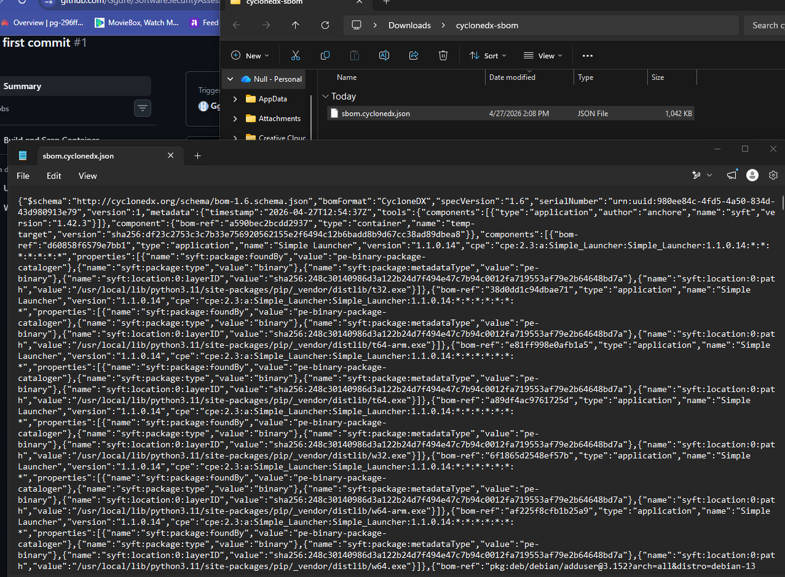

# Task E - Compliance and Supply Chain Security (SBOM + NIST SSDF)

## Objective

Generate a real Software Bill of Materials (SBOM) for the Flask web application and demonstrate how this artifact satisfies the NIST Secure Software Development Framework (SSDF), proving supply-chain assurance compliance.

## What I Did In This Task

In this task, I operationalized SBOM generation as both a local verification activity and a pipeline-governed control. I produced a real SPDX artifact (`sbom.spdx.json`) using Syft, then aligned the workflow to CI/CD via `.github/workflows/generate-sbom.yml` to generate CycloneDX output as a repeatable build artifact. I captured execution evidence for workflow success and artifact retrieval, and mapped implementation outcomes to NIST SSDF practices with explicit control rationale rather than generic standards commentary. I further used concrete dependency data to demonstrate practical vulnerability correlation and response readiness.

## Tools Used

- **Anchore Syft** v1.43.0 — open-source SBOM generation tool.
- **SBOM Formats:** CycloneDX JSON (pipeline artifact) and SPDX JSON (local deep-inspection artifact).
- **CI/CD Automation:** GitHub Actions workflow at `.github/workflows/generate-sbom.yml`.

## Manual Validation Command (Local)

```powershell
# Container-first command (preferred when Docker daemon is running)
syft docker:task-e-target:latest -o cyclonedx-json=Task_E_Compliance/sbom.cyclonedx.json

# Directory fallback command (used for local validation in this workspace)
syft dir:<webapp> -o spdx-json --output spdx-json=Task_E_Compliance/sbom.spdx.json
```

This command scans the entire webapp directory, detects all Python package dependencies from `requirements.txt`, and outputs a structured SPDX-JSON SBOM documenting every component with its exact version and SPDX identifier.

## Automated CI/CD Generation (Lab-Aligned)

The following workflow automates container SBOM generation on each push:

1. Build container image from `webapp/Dockerfile`
2. Run `anchore/sbom-action` against the built image
3. Output CycloneDX JSON as `sbom.cyclonedx.json`
4. Upload artifact `cyclonedx-sbom` for audit evidence

Workflow file:

- `.github/workflows/generate-sbom.yml`

Key implementation detail:

- `docker build -t temp-target:latest ./webapp`
- `format: "cyclonedx-json"`
- `output-file: "sbom.cyclonedx.json"`

This directly aligns with Week 6 Lab 1 expectations for repeatable supply-chain evidence.

## SBOM Contents (Real Output)

| Package | Version | Role |
|---|---|---|
| flask | 3.1.1 | Core web framework |
| werkzeug | 3.1.3 | WSGI utilities and routing |
| jinja2 | 3.1.6 | HTML template engine |
| markupsafe | 3.0.2 | HTML/XML escaping library |
| itsdangerous | 2.2.0 | Cryptographic signing |
| click | 8.1.8 | CLI argument parsing |
| blinker | 1.9.0 | Signal/event dispatching |

**SBOM files:**

- `sbom.spdx.json` (real local Syft output, SPDX-2.3)
- `sbom.cyclonedx.json` (expected CI artifact output from workflow)

## Mapping to NIST SSDF

### PO.3 / PO.5 — Prepare the Organisation

Maintaining a mandatory SBOM generation policy in the CI/CD pipeline satisfies SSDF preparation requirements by defining supply-chain security expectations and tooling standards. The Syft scan configuration enforces this as a repeatable, automated practice.

### PS.1 / PS.2 — Protect the Software

SBOM provides full component transparency, enabling governance of third-party dependencies. This directly satisfies PS.1 (protect software assets from tampering) and PS.2 (protect software from unauthorised access) by ensuring unknown and un-inventoried packages cannot silently enter the codebase.

### PW.2 — Secure Design

Component selection informed by SBOM history allows architects to avoid packages with known vulnerability histories before code is written. The SBOM surfaces risky packages during design rather than after deployment.

### PW.4 / PW.8 — Produce Well-Secured Software

Automated CVE cross-referencing against the SBOM during build and release identifies vulnerable dependencies before deployment. For example, if `jinja2 3.1.6` were found to have an SSTI vulnerability, the SBOM would immediately identify it as present in this application and trigger a blocking remediation gate.

### RV.1 / RV.3 — Respond to Vulnerabilities

When a new CVE is published against any listed package, the SBOM enables immediate scope determination: which applications, versions, and deployments are affected. This transforms the response from reactive guessing to measurable, targeted action. Mean-time-to-assess is reduced from days to minutes.

### RV.2 — Assess Vulnerabilities

The SBOM enables rapid triage of newly published CVEs against all dependency versions in production. Without an SBOM, organizations typically discover exposure weeks after publication. With an SBOM, exposure is known within hours.

## Component Vulnerability Correlation Example

**Package under review:** `jinja2 3.1.6`

**Investigation process:**
1. SBOM identifies `jinja2 3.1.6` as present.
2. CVE feed check against NVD confirms version-specific vulnerability history for jinja2 (check for SSTI-related CVEs).
3. Assess whether the application renders user-controlled input directly in templates.
4. In this application, `app.py` does not use Jinja2 template rendering directly for user data (raw HTML f-strings are used instead), meaning SSTI risk from Jinja2 is not directly applicable.
5. Outcome: monitored, not critical, but flagged for upgrade tracking.

This shows how an SBOM can be used in a practical way for vulnerability response.

## Why SBOM Satisfies Strict Industry Compliance

- **Audit readiness:** SPDX-JSON format is machine-readable and accepted by procurement and regulatory frameworks.
- **Contractual assurance:** Enterprise and government clients increasingly require SBOM delivery as part of software contracts.
- **Regulatory alignment:** Supports US Executive Order 14028 requirements, UK NCSC supply-chain guidance, and ISO/IEC 5962 SBOM standards.
- **Operational resilience:** Shortens mean-time-to-assess on vulnerability disclosure, reducing exposure windows.

## Lab 2 SSDF Mapping Alignment (Evidence-Based)

The task is explicitly mapped using the same approach practiced in Week 6 Lab 2:

- **PS.1 (Protect Software):** CI-based build on clean ephemeral runner (`ubuntu-latest`) reduces tampering risk versus local builds.
- **PW.4 (Provenance):** SBOM artifact records exact package names/versions per build, enabling verifiable component lineage.
- **RV.1 (Ongoing Vulnerability Identification):** machine-readable CycloneDX JSON allows automated repeated CVE correlation.

This ensures the report is not a generic standards essay; it is tied directly to implementation evidence.

## Critical Reflection

An SBOM is not security by itself. Its value depends entirely on three operational conditions: continuous generation (per build), integration with live vulnerability intelligence feeds, and enforced remediation workflows with ownership. A stale SBOM or one that lacks CI integration provides false assurance. When embedded as a continuous practice — not a one-time artifact — it transforms supply-chain security from reactive guessing to measurable, auditable assurance.

## Walkthrough with Evidence (All Files)

### E1 (terminal) - Syft command execution

This screenshot confirms command-line execution of SBOM generation with Syft.



### E1 (packages) - SBOM package output

This evidence captures extracted dependency/package information from the generated SBOM.



### E2 - SSDF mapping diagram

This visual links the implemented workflow to NIST SSDF practices.



### E3 - CVE response workflow

This diagram explains how SBOM artifacts support practical vulnerability response operations.



### E4 - GitHub Actions SBOM success

This confirms CI-based SBOM generation completed successfully.


### E5 - Downloaded CycloneDX artifact

This proves artifact retrieval from pipeline output for audit and traceability.



### E6 - Opened artifact JSON

This confirms the artifact content is accessible and in expected CycloneDX JSON form.



